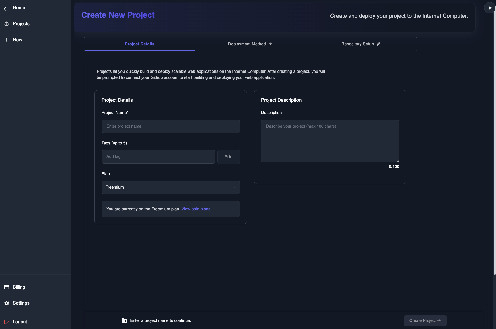
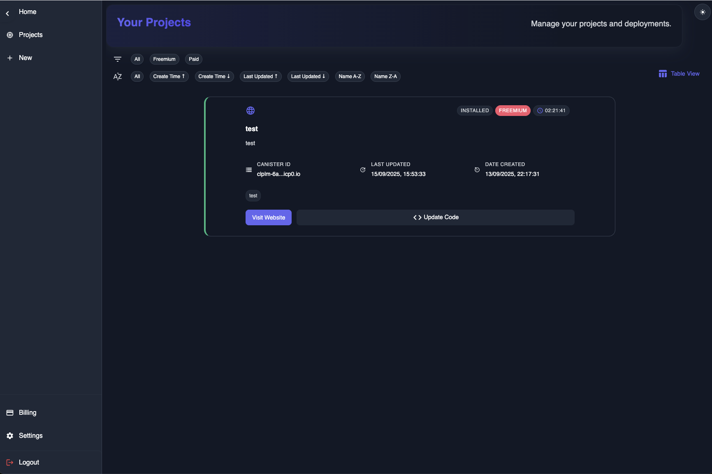
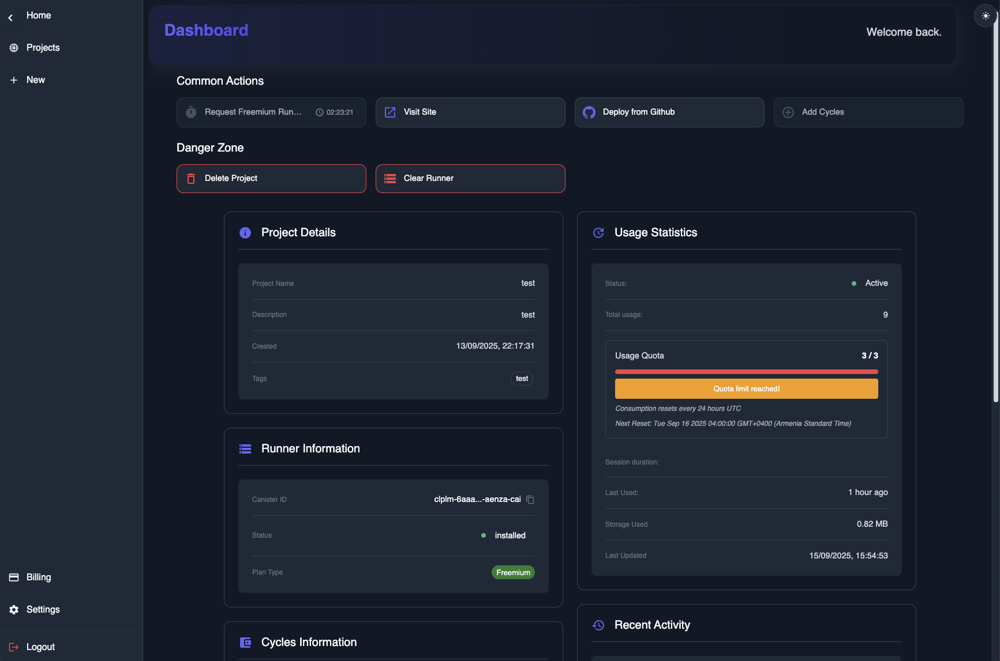

# World Cloud

---

Worldcloud is a _cloud services_ provider specializing in front-end _web application_ deployment.
Worldcloud utilizes the _Internet Computer_ to host static web applications directly ICP's network.
The vision is to bridge the gap between traditional DevOps and ICP infrastructure. By off-loading blockchain
related concepts to Worldcloud, developers are minimally exposed to new material and continue to use the
tools they are familiar with.

Screenshots:

Live Website: [World Cloud](https://worldcloud.app)
Live Backend Canister: `7nopf-3qaaa-aaaam-aeeoq-cai`

## Introduction

World Cloud is a platform used by developers to get started with frontend web application hosting on the _Internet Computer_. With
it's unique approach towards sourcing, building, and publishing your website, World Cloud makes it possible for users of platforms
such as Vercel, Microsoft Azure, and AWS to easily bootstrap and host their favorite frontend application 100% on the _Internet Computer_.

- Ease-of-use: Flow and key concepts similar to products offered by _tech giants_ and majority of developers.
- Plug and play: Seemlessly build and publish web applications directly from your Github repo.
- Custom: Choose your favorite name for your site and link it to your project

### Freemium Project Flow

Publishing a frontend application for free for a duration of 4 hours, 3 times per day.

