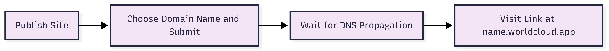

# World Cloud

---

Worldcloud is a _cloud services_ provider specializing in front-end _web application_ deployment.
Worldcloud utilizes the _Internet Computer_ to host static web applications directly ICP's network.
The vision is to bridge the gap between traditional DevOps and ICP infrastructure. By off-loading blockchain
related concepts to Worldcloud, developers are minimally exposed to new material and continue to use the
tools they are familiar with.

- Live Website: [World Cloud](https://worldcloud.app)
- Live Backend Canister: `7nopf-3qaaa-aaaam-aeeoq-cai`

_Screenshots at the end of page._

## Introduction

---

World Cloud is a platform used by developers to get started with frontend web application hosting on the _Internet Computer_. With
it's unique approach towards sourcing, building, and publishing your website, World Cloud makes it possible for users of platforms
such as Vercel, Microsoft Azure, and AWS to easily bootstrap and host their favorite frontend application 100% on the _Internet Computer_.

- Ease-of-use: Flow and key concepts similar to products offered by _tech giants_ and majority of developers.
- Plug and play: Seemlessly build and publish web applications directly from your Github repo.
- Custom: Choose your favorite name for your site and link it to your project

### Technical Overview

The publishing process works as follows:

- a source branch is selected containing the frontend web application source code (reactjs, angular, plain vanilla)
- a custom workflow file is created and triggered with Github Actions
- artifacts are pulled and uploaded to an **asset canister** on the _IC_
- asset canister now serves the uploaded static content directly from the project's asset canister


### Freemium Plan Publishing Flow

Publishing a frontend application for free for a duration of 4 hours, 3 times per day.


### Paid Plan Publishing Flow

Publishing a frontend web application to a project with a _paid plan_ means that the user owns the **asset canister** and
are the controllers of the canisters. The publishing flow is similar to the freemium plan.


### Link Custom Subdomain Flow

When a project publishes a frontend application, the url used to access the application will typically follow the pattern:

`<canister-id>.icp0.io`

In order for users to access their sites from a custom domain like `mywebsite.worldcloud.app`, an add-on can be attached to
the project to allow registering the DNS records required to serve the frontend application from the user's chosen _subdomain_ name.



## Installation

---

Step-by-step guide to get a copy of the project up and running locally for development and testing.

### Prerequisites

- Node: `>=16.0.0`
- npm: `>=7.0.0`
- dfx: `0.29.1`
- mops

#### Node and npm

Follow the guide to install node on your machine.

```
https://docs.npmjs.com/downloading-and-installing-node-js-and-npm
```

#### dfx

You will need the latest version of `dfx`

```
sh -ci "$(curl -fsSL https://internetcomputer.org/install.sh)"
```

#### mops

```
npm i -g ic-mops
```

### Install and Run

---

```
git clone https://github.com/georgiod9/icp-migrator-canisters # clone repo
cd icp-migrator-canisters
dfx start --clean                                             # start the local replica
sh commands/deploy-ledger.sh                                  # deploy ICP ledger canister
sh commands/workflow/deploy.sh develop                         # deploy project canisters and dependencies
sh commands/fabricate_cycles.sh                               # fund the backend canister with cycles
cd src/migrator-management-canister-frontend                  # switch to frontend directory
npm install                                                   # ensure node modules are installed
npm run dev                                                   # run development server

```

### Usage

---

#### User Facing

This project is intended to be used from the frontend web application.
Visit the dashboard: [World Cloud](https://worldcloud.app/dashboard)

User flow - freemium:

1. Subscribe to freemium plan
2. Connect Github account
3. Choose source branch
4. Start deployment process
5. Visit website at generated link

### Documentation

---

User-facing methods: [here](./documentation/basic_actor_user_methods.md)
Admin methods: [here](./documentation/basic_actor_admin_methods.md)

### Roadmap

---

The following outlines the main achieved and pending milestones:

[-] Integrate Github Actions to handle build process
[-] Create Subscription plans to manage user activity and access
[-] Freemium Model and Seamless Cycles Management
[-] Custom Domains and Web2 Auth
[ ] Publish to private domains with user's nameservers
[ ] Encrypted File Storage
[ ] Unity Application Hosting

### License

---

No license yet.

### Acknowledgements

- I would like to thank the Dfinity Foundation for supporting this project with a Grant
- Big shout out to Dfinity engineering team for all the hard work, sleepless hours, and **innovation**

### References

---

- [Internet Computer](https://internetcomputer.org/)

## Screenshots

---


